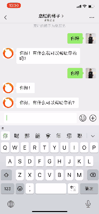
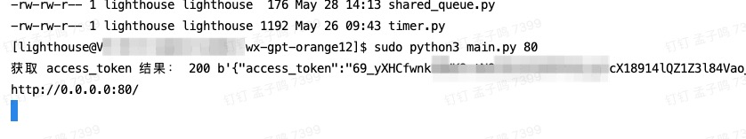

# wx-gpt-orange12

微信小程序接入 ChatGPT，服务端不用翻墙也可正常调用。本仓库为**服务端**代码。

示例：

## 环境说明

1. 腾讯云服务器（或自己电脑）
2. Python3.9.9
3. [cloudflare 账号](https://dash.cloudflare.com/login)，用于域名转发
4. 一个 ChatGPT 账号

## 快速开始

在服务器内克隆项目：

`sudo git clone https://github.com/z1ming/wx-gpt-orange12.git`

进入项目主目录：

`cd wx-gpt-orange12`

运行项目：

`sudo python3 main.py 80`

出现以下信息说明运行成功：

